# Tributary


An end-to-end data pipeline that moves raw retail order data from flat-file storage into a tested, production-style analytics warehouse — with automated CI/CD gating every change before it reaches production, and an AI layer on top that can query the pipeline, search unstructured data semantically, and diagnose and fix real failures through that same CI/CD gate.

Built to demonstrate the full data engineering lifecycle in miniature: ingestion, transformation, orchestration, testing, and deployment, using the same tools (Airflow, dbt, Snowflake, GitHub Actions) that run these workloads in production environments — plus a self-hosted AI layer (dbt MCP Server, Snowflake Cortex) grounded in the real project rather than a toy example.

## What it does

1. A raw CSV of ~10,000 retail orders lands in an S3 bucket.
2. Snowflake's `COPY INTO` loads it into a raw staging table.
3. dbt transforms it into a tested star schema (customers, products, dates, and an order-line fact table).
4. Apache Airflow orchestrates all of the above on a daily schedule, with retries.
5. Every pull request triggers an automated `dbt build` against an isolated CI schema; a merge to `main` automatically redeploys the production schema. A branch protection rule makes the CI check mandatory — code cannot reach production without passing it.
6. An AI layer sits on top: a self-hosted dbt MCP Server lets an agent query the live project directly, Snowflake Cortex embeddings power semantic search over unstructured review text, and a triage agent diagnosed and fixed a real pipeline bug through a real, CI-gated pull request. See [AI layer](#ai-layer) below.

## Architecture

```mermaid
flowchart LR
    subgraph Ingestion
        A1[Sample Superstore CSV] -->|fetch_data| B1[(S3 raw/date)]
        B1 -->|upload_to_s3 + COPY INTO| C1[(RAW.SUPERSTORE_ORDERS)]
        A2[Product reviews CSV] -->|upload_reviews_to_s3, fixed key| B2[(S3 raw/reference)]
        B2 -->|COPY INTO| C2[(RAW.PRODUCT_REVIEWS)]
    end

    subgraph Transformation["Transformation — dbt"]
        C1 --> D1[stg_orders]
        D1 --> E1[dim_customers]
        D1 --> E2[dim_products]
        D1 --> E3[dim_dates]
        D1 --> F1[fct_orders]
        E1 --> F1
        E2 --> F1
        E3 --> F1
        C2 --> D2[stg_reviews]
    end

    subgraph AILayer["AI layer"]
        D2 -->|Cortex EMBED_TEXT_768| G1[review_embeddings]
        G1 -->|VECTOR_COSINE_SIMILARITY| G2{{Semantic search}}
        MCP[[dbt MCP Server]] -.->|build/test/show/compile| D1
        MCP -.-> G1
        MCP --> TRI[[Triage agent]]
        TRI -->|diagnosed + fixed real bug| PR5[PR #5, merged]
    end

    subgraph Orchestration["Orchestration — Airflow, Docker Compose"]
        DAG["DAG: tributary_pipeline\n@daily · retries=2"]
    end

    DAG -.->|triggers daily| A1
    DAG -.->|triggers daily| A2
    DAG -.->|triggers| D1

    F1 -->|clustered on order_date| STAR[(Analytics-ready star schema)]

    subgraph CICD["CI/CD — GitHub Actions"]
        PRQ[Pull Request] -->|dbt build --target ci| CI[(TRIBUTARY.CI schema)]
        CI -->|required check passes| MERGE[Merge to main]
        MERGE -->|dbt build --target prod| PROD[(TRIBUTARY.ANALYTICS schema)]
    end

    STAR -.-> PRQ
    PR5 -.-> PRQ
```



Every arrow above is a real, automated step — nothing in this diagram is aspirational.

## Tech stack

| Layer | Tool | Why |
|---|---|---|
| Storage / landing zone | Amazon S3 | Cheap, durable landing spot before anything touches the data |
| Data warehouse | Snowflake | `COPY INTO` loading, clustering keys, and Time Travel used deliberately, not just as a place to put tables |
| Transformation | dbt Core | Version-controlled SQL, a real dependency graph, and tests as first-class citizens |
| Orchestration | Apache Airflow (Docker Compose, LocalExecutor) | Scheduling, retries, and dependency management instead of a cron job with no error handling |
| CI/CD | GitHub Actions | Automated `dbt build` on every PR; automated production deploy on merge; branch protection enforcing the check |
| AI / agent layer | dbt MCP Server, Snowflake Cortex | Self-hosted, no new infra accounts required — grounds an agent in the real schema and lets it diagnose and fix real failures through the same CI/CD gate as any other change |

## Repo structure

```
tributary/
├── airflow/
│   ├── dags/tributary_pipeline.py   # the DAG: fetch/upload/load for both orders and reviews → dbt build
│   └── docker-compose.yaml          # Postgres + Airflow webserver/scheduler, LocalExecutor
├── transform/                       # the dbt project
│   ├── dbt_project.yml
│   └── models/
│       ├── staging/                 # stg_orders, stg_reviews — cast types, rename columns
│       ├── marts/                   # dim_customers, dim_products, dim_dates, fct_orders + schema.yml tests
│       └── ai/                      # review_embeddings — Cortex EMBED_TEXT_768 over stg_reviews
├── sql/
│   ├── 00_setup.sql                 # warehouse / database / schema bootstrap
│   ├── 01_load_raw.sql              # stage + COPY INTO definition (orders)
│   └── 02_load_raw_reviews.sql      # raw table + COPY INTO for product reviews (fixed S3 key)
├── .github/workflows/
│   ├── pr-checks.yml                # dbt build --target ci, on every pull request
│   └── deploy.yml                   # dbt build --target prod, on push to main
└── docs/
    └── time-travel-recovery.md      # Snowflake Time Travel: simulated corruption + recovery
```

## Data quality

Every model is tested, not just built:

- `unique` + `not_null` on every primary key
- `relationships` tests tying `fct_orders` back to each dimension table
- `accepted_values` on categorical fields (region, ship mode, category)

These aren't decorative. Real data issues surfaced during development and were fixed at the model layer rather than by silencing the test:

- **Duplicate product mappings.** 32 `product_id` values in the raw data mapped to more than one product name/category. Fixed with a `QUALIFY ROW_NUMBER() OVER (...)` dedup in `dim_products`, keeping one canonical row per product.
- **Duplicate order loads — twice.** First surfaced early: a `unique` test on `row_id` caught exactly double the expected row count after a re-run reloaded the same file, traced to `COPY INTO`'s file-signature-based dedup not catching a byte-identical re-upload. Fixed at the time with a truncate-and-reload. The underlying idempotency gap was called out explicitly in "what I'd change" as unresolved — and it resurfaced later, from a different structural cause (date-partitioned ingestion of what is actually static reference data, accumulating a duplicate on every DAG run). This second occurrence became the real-bug scenario for the AI layer's triage agent, below, and got a structural fix instead of another one-off patch.

## Snowflake features used deliberately

- **Clustering key** on `fct_orders` (`LINEAR(order_date)`) — the largest table in the schema, chosen because it's the one query patterns would actually filter and range-scan on.
- **Time Travel recovery** — a full simulated incident: a bad `UPDATE` zeroed out a column in production, and the fix was querying and restoring from Snowflake's time-travel history rather than reaching for a backup that didn't exist. Full write-up with screenshots: [`docs/time-travel-recovery.md`](docs/time-travel-recovery.md).
- **Cortex `EMBED_TEXT_768`** — used in the AI layer below to embed unstructured review text with `snowflake-arctic-embed-m`, searched by meaning via `VECTOR_COSINE_SIMILARITY`.

## CI/CD pipeline

Two GitHub Actions workflows, both authoring a `profiles.yml` at runtime from encrypted repository secrets — no credentials ever committed:

**`pr-checks.yml`** — on every pull request against `main`, spins up a clean runner, installs `dbt-snowflake`, and runs `dbt build --target ci` against a dedicated, disposable `TRIBUTARY.CI` schema. This deliberately runs `dbt build` rather than just `dbt test`: a PR that changes a model needs that model rebuilt before its tests mean anything, not tested against yesterday's version of the table.

**`deploy.yml`** — on every push to `main` (i.e., every merge), runs `dbt build --target prod` against the real `TRIBUTARY.ANALYTICS` schema.

**Branch protection** on `main` requires the `dbt-build-and-test` check to pass before a PR can be merged — the CI step isn't just informational, it's a gate. The AI layer's triage agent used this exact gate for its fix (see below) — it didn't get special access to bypass CI.

## AI layer

Three capabilities layered on top of the pipeline above, each self-hosted and each proven against this real project rather than a toy example.

**1. dbt MCP Server.** Self-hosted (`uvx dbt-mcp`), CLI-only — no dbt Cloud account required. Connected through a local MCP client and pointed at `transform/`, so an agent can run real `dbt build`, `test`, `show`, and `compile` commands directly against the live warehouse instead of guessing at schema from stale docs.

**2. Snowflake Cortex embeddings + vector search.** A second, unstructured dataset — 23,486 real customer reviews (Women's Clothing E-Commerce Reviews) — loaded and embedded with `snowflake-arctic-embed-m` via `EMBED_TEXT_768` in `transform/models/ai/review_embeddings.sql`. Searchable by meaning through `VECTOR_COSINE_SIMILARITY`, not keyword matching. (A first-choice dataset, a customer-support-ticket set, was rejected before any pipeline work started — inspection found roughly 40% of its rows were templated placeholder text rather than real customer language.)

**3. Pipeline-failure-triage agent.** Connects to both of the above. Used to diagnose the real duplicate-order-loads recurrence described in "Data quality" above: `RAW.SUPERSTORE_ORDERS` had 19,988 total rows against 9,994 distinct `ROW_ID`s — an exact 2x duplication. The agent queried the warehouse directly through the MCP connection to confirm the root cause with hard numbers, then shipped a fix as a defensive `QUALIFY ROW_NUMBER() OVER (PARTITION BY row_id ORDER BY row_id) = 1` dedup in `stg_orders.sql` — making the model idempotent against any future duplicate load, rather than patching this one instance again. The fix went out through a real branch and PR ([#5](https://github.com/NicRudiger/tributary/pull/5)), passed the same `pr-checks.yml` CI run as any other change, and was merged — closing the idempotency gap flagged below for good.

## Running it locally

```bash
git clone https://github.com/NicRudiger/tributary.git
cd tributary

# dbt
cd transform
python3 -m venv .venv && source .venv/bin/activate
pip install dbt-snowflake
# populate ~/.dbt/profiles.yml with your own Snowflake credentials
dbt build

# Airflow (from the repo root)
cd ../airflow
cp .env.example .env   # fill in your own AWS + Snowflake credentials
docker compose up airflow-init
docker compose up -d
# UI at localhost:8080

# AI layer (optional — requires uv and an MCP-capable client)
curl -LsSf https://astral.sh/uv/install.sh | sh
uvx dbt-mcp   # configure DBT_PROJECT_DIR / DBT_PATH per your MCP client
```

## What I'd change with more time

Named here on purpose — these are the trade-offs made to keep scope tight, not blind spots:

- **Static AWS keys on the Snowflake stage → a storage integration with an IAM role.** No long-lived credential should sit inside Snowflake if it doesn't have to.
- **`ACCOUNTADMIN` everywhere → a scoped role** with only the grants the pipeline actually needs.
- **Full-refresh models → incremental materialization** on `fct_orders` once data volume made a full rebuild wasteful.
- **Deprecated generic-test YAML syntax in `schema.yml`, kept on purpose.** The Airflow containers are pinned to `dbt-core==1.7.13` because of a protobuf dependency conflict, and that version cannot parse the newer nested `arguments:` test syntax at all. The flat syntax used here is the only one that works in both the Airflow containers and the newer dbt (1.12.x) used locally and in CI, at the cost of a deprecation warning on the newer side. Fixing this for real means resolving the underlying Airflow/protobuf version pin, not just editing the YAML.

(The `COPY INTO` idempotency gap that used to be listed here was closed for real via the AI layer's triage-agent fix above, rather than staying a known trade-off.)

## Engineering notes

The DAG wiring in particular surfaced five distinct, real bugs stacked on top of each other — a source path one directory too shallow, a Snowflake connection URI with the account in the wrong slot, a missing CSV quote-handling option, a forced dbt version downgrade due to an Airflow/protobuf dependency conflict, and the COPY INTO idempotency issue described above. Each one masked the next until it was fixed. Worth mentioning in an interview as an example of methodical debugging rather than guessing — reproducing failures directly inside the container, reading raw log files instead of trusting a UI that was silently truncating output, and confirming each fix with evidence before moving to the next layer.

The AI layer's triage agent fix is the same pattern applied a level up: a live, numeric diagnosis (19,988 vs 9,994 rows) before writing a single line of fix code, a structural fix chosen over a one-off patch, and verification against the real `dbt build`/`test` suite before it ever touched git — then shipped through the exact same CI gate as a human-authored change.
