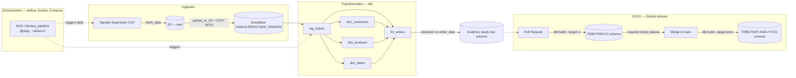

# Tributary

An end-to-end data pipeline that moves raw retail order data from flat-file storage into a tested, production-style analytics warehouse — with automated CI/CD gating every change before it reaches production.

Built to demonstrate the full data engineering lifecycle in miniature: ingestion, transformation, orchestration, testing, and deployment, using the same tools (Airflow, dbt, Snowflake, GitHub Actions) that run these workloads in production environments.

## What it does

1. A raw CSV of ~10,000 retail orders lands in an S3 bucket.
2. Snowflake's `COPY INTO` loads it into a raw staging table.
3. dbt transforms it into a tested star schema (customers, products, dates, and an order-line fact table).
4. Apache Airflow orchestrates all of the above on a daily schedule, with retries.
5. Every pull request triggers an automated `dbt build` against an isolated CI schema; a merge to `main` automatically redeploys the production schema. A branch protection rule makes the CI check mandatory — code cannot reach production without passing it.

## Architecture



Every arrow above is a real, automated step — nothing in this diagram is aspirational.

## Tech stack

| Layer | Tool | Why |
|---|---|---|
| Storage / landing zone | Amazon S3 | Cheap, durable landing spot before anything touches the data |
| Data warehouse | Snowflake | `COPY INTO` loading, clustering keys, and Time Travel used deliberately, not just as a place to put tables |
| Transformation | dbt Core | Version-controlled SQL, a real dependency graph, and tests as first-class citizens |
| Orchestration | Apache Airflow (Docker Compose, LocalExecutor) | Scheduling, retries, and dependency management instead of a cron job with no error handling |
| CI/CD | GitHub Actions | Automated `dbt build` on every PR; automated production deploy on merge; branch protection enforcing the check |

## Repo structure

```
tributary/
├── airflow/
│   ├── dags/tributary_pipeline.py   # the 4-task DAG: fetch → upload → load → dbt build
│   └── docker-compose.yaml          # Postgres + Airflow webserver/scheduler, LocalExecutor
├── transform/                       # the dbt project
│   ├── dbt_project.yml
│   └── models/
│       ├── staging/                 # stg_orders — cast types, rename columns
│       └── marts/                   # dim_customers, dim_products, dim_dates, fct_orders + schema.yml tests
├── sql/
│   ├── 00_setup.sql                 # warehouse / database / schema bootstrap
│   └── 01_load_raw.sql              # stage + COPY INTO definition
├── .github/workflows/
│   ├── pr-checks.yml                # dbt build --target ci, on every pull request
│   └── deploy.yml                   # dbt build --target prod, on push to main
└── docs/
    └── time-travel-recovery.md      # Snowflake Time Travel: simulated corruption + recovery
```

## Data quality

Every model is tested, not just built:

- `unique` + `not_null` on every primary key
- `relationships` tests tying `fct_orders` back to each dimension table
- `accepted_values` on categorical fields (region, ship mode, category)

These aren't decorative. Two real data issues surfaced during development and were fixed at the model layer rather than by silencing the test:

- **Duplicate product mappings.** 32 `product_id` values in the raw data mapped to more than one product name/category. Fixed with a `QUALIFY ROW_NUMBER() OVER (...)` dedup in `dim_products`, keeping one canonical row per product.
- **Duplicate order loads.** A `unique` test on `row_id` caught exactly double the expected row count (19,988 instead of 9,994) after a re-run reloaded the same file. Root cause: Snowflake's `COPY INTO` deduplication is keyed to a file's signature, and re-uploading to S3 with `replace=True` changes that signature even when the content is byte-identical — so a re-run looked like new data instead of a repeat. Fixed by truncating and reloading cleanly; the underlying idempotency gap is called out explicitly in the "what I'd change" section below.

## Snowflake features used deliberately

- **Clustering key** on `fct_orders` (`LINEAR(order_date)`) — the largest table in the schema, chosen because it's the one query patterns would actually filter and range-scan on.
- **Time Travel recovery** — a full simulated incident: a bad `UPDATE` zeroed out a column in production, and the fix was querying and restoring from Snowflake's time-travel history rather than reaching for a backup that didn't exist. Full write-up with screenshots: [`docs/time-travel-recovery.md`](docs/time-travel-recovery.md).

## CI/CD pipeline

Two GitHub Actions workflows, both authoring a `profiles.yml` at runtime from encrypted repository secrets — no credentials ever committed:

**`pr-checks.yml`** — on every pull request against `main`, spins up a clean runner, installs `dbt-snowflake`, and runs `dbt build --target ci` against a dedicated, disposable `TRIBUTARY.CI` schema. This deliberately runs `dbt build` rather than just `dbt test`: a PR that changes a model needs that model rebuilt before its tests mean anything, not tested against yesterday's version of the table.

**`deploy.yml`** — on every push to `main` (i.e., every merge), runs `dbt build --target prod` against the real `TRIBUTARY.ANALYTICS` schema.

**Branch protection** on `main` requires the `dbt-build-and-test` check to pass before a PR can be merged — the CI step isn't just informational, it's a gate.

## Running it locally

```bash
git clone https://github.com/NicRudiger/tributary.git
cd tributary

# dbt
cd transform
python3 -m venv .venv && source .venv/bin/activate
pip install dbt-snowflake
# populate ~/.dbt/profiles.yml with your own Snowflake credentials
dbt build

# Airflow (from the repo root)
cd ../airflow
cp .env.example .env   # fill in your own AWS + Snowflake credentials
docker compose up airflow-init
docker compose up -d
# UI at localhost:8080
```

## What I'd change with more time

Named here on purpose — these are the trade-offs made to keep scope tight, not blind spots:

- **Static AWS keys on the Snowflake stage → a storage integration with an IAM role.** No long-lived credential should sit inside Snowflake if it doesn't have to.
- **`ACCOUNTADMIN` everywhere → a scoped role** with only the grants the pipeline actually needs.
- **Full-refresh models → incremental materialization** on `fct_orders` once data volume made a full rebuild wasteful.
- **`COPY INTO` idempotency gap** — re-running the same logical date currently relies on the file signature staying stable. A more robust design would key deduplication off of business logic (e.g., a `MERGE` on order ID) rather than file-level dedup.
- **Deprecated generic-test YAML syntax in `schema.yml`, kept on purpose.** The Airflow containers are pinned to `dbt-core==1.7.13` because of a protobuf dependency conflict, and that version cannot parse the newer nested `arguments:` test syntax at all. The flat syntax used here is the only one that works in both the Airflow containers and the newer dbt (1.12.x) used locally and in CI, at the cost of a deprecation warning on the newer side. Fixing this for real means resolving the underlying Airflow/protobuf version pin, not just editing the YAML.

## Engineering notes

The DAG wiring in particular surfaced five distinct, real bugs stacked on top of each other — a source path one directory too shallow, a Snowflake connection URI with the account in the wrong slot, a missing CSV quote-handling option, a forced dbt version downgrade due to an Airflow/protobuf dependency conflict, and the COPY INTO idempotency issue above. Each one masked the next until it was fixed. Worth mentioning in an interview as an example of methodical debugging rather than guessing — reproducing failures directly inside the container, reading raw log files instead of trusting a UI that was silently truncating output, and confirming each fix with evidence before moving to the next layer.
